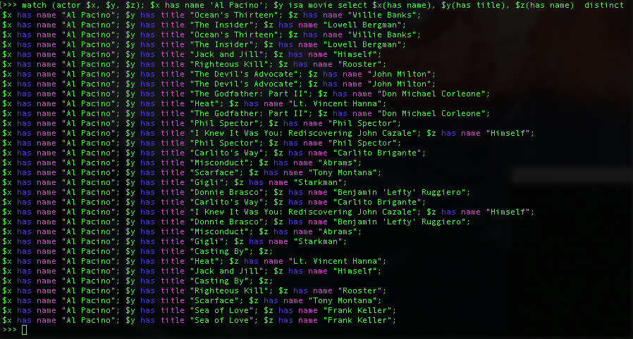

Movies Sample Dataset
=====================

This sample dataset containing a small subset of the data behind the [Moogi](http://moogi.co) movie search engine.
There are two version of this sample dataset.
The "large-dataset" contains information on about 7300 movies and about 20000 people.
The "small-dataset" contains information on about 1700 movies and about 5300 people.

After having downloaded the files and started the MindmapsDB engine, the .gql files must be loaded into the engine in a specific order. _Notice that this can take easily take more than 30 minutes for the large dataset, depending on your computer._

In order to check the status of the loading, you can open a new terminal, navigate to the directory

```
PATH/TO/mindmapsdb/mindmaps-dist/target/mindmaps-dist-0.X/logs
```

and run the command

```
tail -f mindmaps.log
```

First the schema file must be loaded, by running the following command into your favourite shell
```
curl -H "Content-Type: application/json" -X POST -d '{"path":"/PATH/TO/schema.gql"}' http://localhost:4567/import/ontology
```
After that, the data has to be loaded. 
```
curl -H "Content-Type: application/json" -X POST -d '{"path":"/PATH/TO/movie-data.gql"}' http://localhost:4567/import/batch/data
```

If everything went well, you will be able to query you new dataset.


